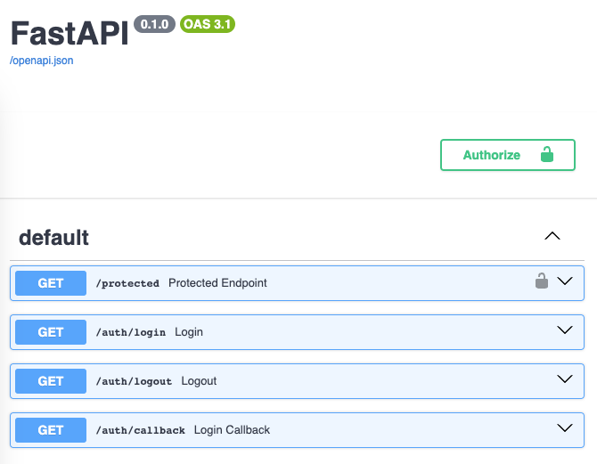

# Using with fastapi's Security

Even though `fastapi-sso` does not try to solve login and authentication, it is clear that you
will probably mostly use it to protect your endpoints. This is why it is important to know how
to use it with fastapi's security.

You were asking how to put the lock 🔒 icon to your Swagger docs
in [this issue](https://github.com/tomasvotava/fastapi-sso/issues/33). This is how you do it.

## Requirements

- `fastapi` - obviously
- `fastapi-sso` - duh
- `python-jose[cryptography]` - to sign and verify our JWTs

## Explanation

Fastapi-SSO is here to arrange the communication between your app and the login provider (such as Google).
It does not store any state of this communication and so it is up to you to make sure you don't have to
ask the user to login again and again.

There are millions of ways how to do this, but the most common one is to use JWTs. You can read more about
them [here](https://jwt.io/introduction/). In short, JWT is a token that contains some data and is signed
by a secret key. This means that you can verify that the token was created by you and that the data inside
the token was not changed.

This makes JWTs very helpful, because it's the thing that comes from the user that you can actually trust.

In this example, we will save the JWT into a cookie so that the user sends it with every request. We will
also use fastapi's `Depends` to make sure that the user is authenticated before accessing the endpoint.

## Example

```python
import datetime  # to calculate expiration of the JWT
from fastapi import FastAPI, Depends, HTTPException, Security, Request
from fastapi.responses import RedirectResponse
from fastapi.security import APIKeyCookie  # this is the part that puts the lock icon to the docs
from fastapi_sso.sso.google import GoogleSSO  # pip install fastapi-sso
from fastapi_sso.sso.base import OpenID

from jose import jwt  # pip install python-jose[cryptography]

SECRET_KEY = "this-is-very-secret"  # used to sign JWTs, make sure it is really secret
CLIENT_ID = "your-client-id"  # your Google OAuth2 client ID
CLIENT_SECRET = "your-client-secret"  # your Google OAuth2 client secret

sso = GoogleSSO(client_id=CLIENT_ID, client_secret=CLIENT_SECRET, redirect_uri="http://127.0.0.1:5000/auth/callback")

app = FastAPI()


async def get_logged_user(cookie: str = Security(APIKeyCookie(name="token"))) -> OpenID:
    """Get user's JWT stored in cookie 'token', parse it and return the user's OpenID."""
    try:
        claims = jwt.decode(cookie, key=SECRET_KEY, algorithms=["HS256"])
        return OpenID(**claims["pld"])
    except Exception as error:
        raise HTTPException(status_code=401, detail="Invalid authentication credentials") from error


@app.get("/protected")
async def protected_endpoint(user: OpenID = Depends(get_logged_user)):
    """This endpoint will say hello to the logged user.
    If the user is not logged, it will return a 401 error from `get_logged_user`."""
    return {
        "message": f"You are very welcome, {user.email}!",
    }


@app.get("/auth/login")
async def login():
    """Redirect the user to the Google login page."""
    async with sso:
        return await sso.get_login_redirect()


@app.get("/auth/logout")
async def logout():
    """Forget the user's session."""
    response = RedirectResponse(url="/protected")
    response.delete_cookie(key="token")
    return response


@app.get("/auth/callback")
async def login_callback(request: Request):
    """Process login and redirect the user to the protected endpoint."""
    async with sso:
        openid = await sso.verify_and_process(request)
        if not openid:
            raise HTTPException(status_code=401, detail="Authentication failed")
    # Create a JWT with the user's OpenID
    expiration = datetime.datetime.now(tz=datetime.timezone.utc) + datetime.timedelta(days=1)
    token = jwt.encode({"pld": openid.dict(), "exp": expiration, "sub": openid.id}, key=SECRET_KEY, algorithm="HS256")
    response = RedirectResponse(url="/protected")
    response.set_cookie(
        key="token", value=token, expires=expiration
    )  # This cookie will make sure /protected knows the user
    return response


if __name__ == "__main__":
    import uvicorn

    uvicorn.run(app, host="127.0.0.1", port=5000)
```

## Result

### Docs now show the lock icon

Visit [`http://127.0.0.1:5000/docs/`](http://127.0.0.1:5000/docs/)



### Accessing the `/protected` endpoint before login

Try visiting [`http://127.0.0.1:5000/protected`](http://127.0.0.1:5000/protected). You will get a 401 error.

```json
{
    "detail": "Not authenticated"
}
```

### Accessing the `/protected` endpoint after login

First visit [`http://127.0.0.1:5000/auth/login`](http://127.0.0.1:5000/auth/login) to login with Google.
Then visit [`http://127.0.0.1:5000/protected`](http://127.0.0.1:5000/protected).

```json
{
    "message": "You are very welcome, ijustfarted@example.com"
}
```

If you want to retry everything, either delete the cookie from your browser or visit
[`http://127.0.0.1:5000/auth/logout`](http://127.0.0.1:5000/auth/logout).
